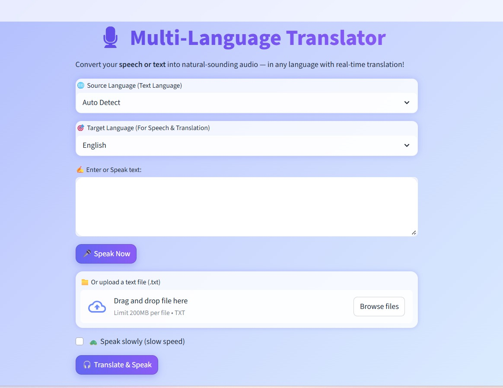

# 🎙 Multi Language Translator

---

## *1. Project Title*

*Language Translator using Machine Learning: Real-Time Speech-to-Text Translation and Text-to-Speech System Using Machine Learning*

---

## *2. Members Information*

| Name of Student    | Reg. No.   | Contribution                                                                                                                  |
| ------------------ | ---------- | ------------------------------------------------------------------------------------------------------------------------------ |
| Shubhangi G. Pawar | 2023BIT048 | Worked on documentation, prepared the README file, uploaded the project to GitHub, and ensured the app runs correctly.        |
| Komal A. Rathod    | 2023BIT502 | Studied the AI Voice Translator project in detail, understood ML and translation workflows, and tested functionalities.       |
| Shital N. Bhadre   | 2023BIT008 | Modified the project code, integrated minor improvements, and helped deploy the app on Streamlit.                             |

---

## *3. Project Description*

*Multi Language Translator* is a web-based application that allows users to *convert speech or text into translated audio in multiple languages*.

### *Purpose:*

* To help users *communicate across languages easily* by providing real-time translation and speech output.
* To make learning and communication accessible and interactive with voice-enabled features.

### *Key Features:*

* Voice input using microphone for speech recognition.
* Text input or file upload for translation.
* Real-time translation into 18 languages using *Neural Machine Translation (NMT)*.
* Text-to-speech generation in the target language using *deep learning-based TTS (WaveNet)*.
* Option for slow speech for better comprehension.
* Translation history saved within the session.

### *Technologies & Algorithms Used:*

* *Python Libraries:* Streamlit, gTTS, SpeechRecognition, deep-translator
* *Machine Learning / AI Models:*

  * *Speech Recognition:* Deep learning models for audio-to-text conversion
  * *Translation:* Transformer-based Neural Machine Translation (NMT) models
  * *Text-to-Speech:* WaveNet / deep neural networks for natural-sounding speech
* *Frontend / UI:* Custom animated Streamlit interface with gradients, glassmorphism, and interactive buttons.

---

### *4. Installation & Usage*

1. Clone the repository:

bash
git clone https://github.com/yourusername/ai-voice-translator.git
cd ai-voice-translator

2. Install dependencies:

bash
pip install -r requirements.txt

3. Run the application:

bash
streamlit run app.py

4. Use the app to *speak or type text*, select a target language, and listen to the translated audio.

---

### *5. Screenshots / Demo*

